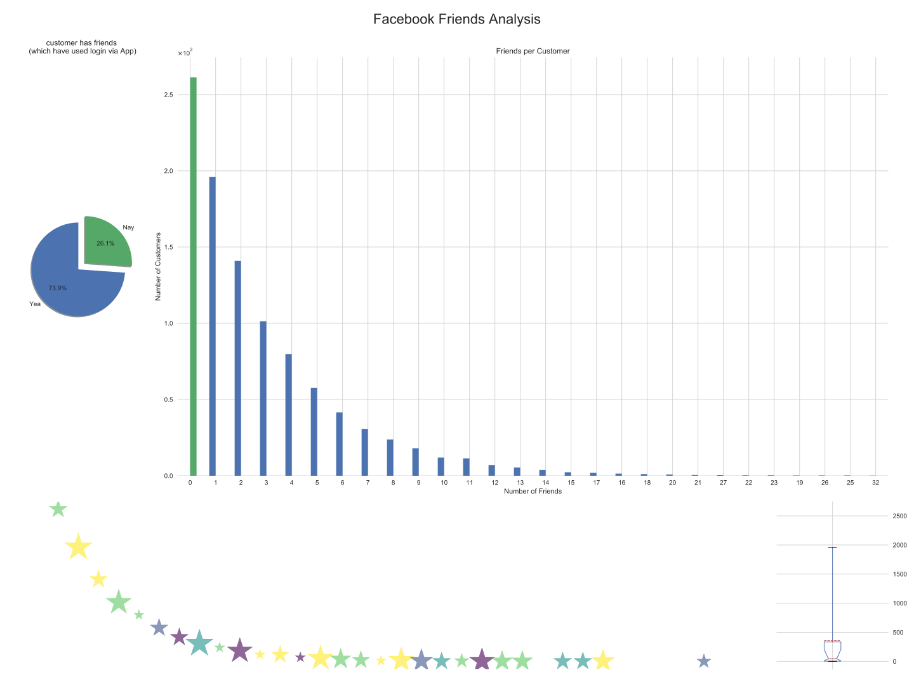

# Nicos Showcase Repository 
Here you can find various prepared notebooks or scripts, basically it is like what it is named: a showcase of `jupyter notebooks`.

The first notebook to have a look on is [heftige_plots_amk](./heftige_plots_amk.ipynb), which shows how to produce this graphic:

Okay, please try to create the following images:
