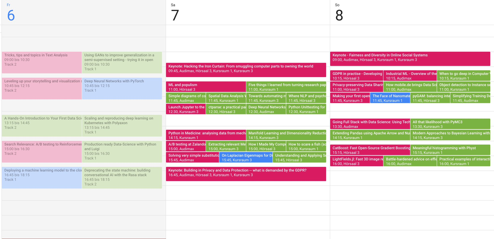

# Warning
I'm currently in the train, so can't check that, but maybe you have to switch to the other branch. Weird, the notebook files are the same, but somehow the one in master did noch load in githubs web preview.

# Pydata Berlin 2018
I created two scripts: one (already existed at the last pydatabln in 2017) for querying the schedule and talk details, you can find under [pydatabln2018_filter_and_overview.ipynb](pydatabln2018_filter_and_overview.ipynb). Another one for pushing the data to according google calendars, look under [write2cal.ipynb](write2cal.ipynb).

## Example

